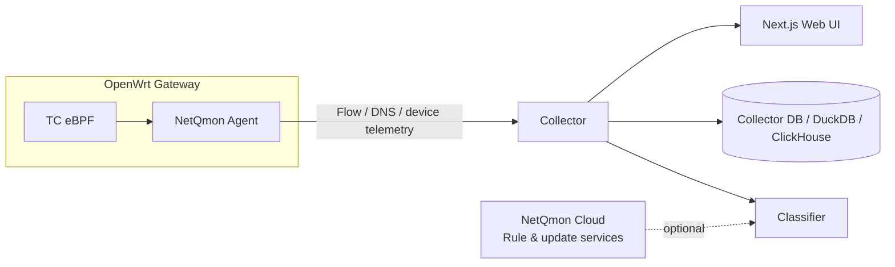

<p align="center">
  Network visibility for OpenWrt — from clients and applications to flows and destinations.
</p>

<p align="center">
  <strong>English</strong> · <a href="docs/README.zh-CN.md">简体中文</a>
</p>

<p align="center">
  
  
  
  
</p>

<p align="center">
  
</p>

NetQmon is a self-hosted network observability platform built for OpenWrt. It shows what is using your network, where traffic is going, and how that activity changes over time — without turning the router itself into a heavy analytics box.

A lightweight Agent runs on the gateway and collects flow telemetry with TC eBPF. The Controller handles storage, classification, realtime views, historical queries, and the web interface.

> NetQmon focuses on **observability**. It is not intended to replace your firewall, QoS, or network policy system.

## Highlights

| | |
| --- | --- |
| **Clients** | Realtime upload/download, traffic history, IP/MAC/hostname correlation, and device identity signals. |
| **Applications** | Classify traffic by organization, application, category, domain, protocol, IP/ASN metadata, and bounded DPI signals. |
| **Flows** | Explore IPv4/IPv6 flows with source, destination, protocol, ports, bytes, and classification context. |
| **Destinations** | Understand where traffic goes with domain, country/region, ASN/ISP, and geographic views. |
| **Realtime + history** | Follow current activity and query historical ranges from the same interface. |
| **OpenWrt-native** | TC eBPF data plane, native `procd` service, UCI configuration, diagnostics, and optional LuCI integration. |
| **Self-hosted Controller** | Docker deployment with a local collector database, DuckDB analytics by default, and optional ClickHouse analytics for larger datasets. |

## How it works



The Agent stays focused on capture and lightweight enrichment. Expensive work — classification, aggregation, historical queries, and visualization — belongs on the Controller.

## Quick start

### Controller

```bash
git clone https://github.com/jarvis2f/netqmon.git
cd netqmon
docker compose up -d
```

Open `http://localhost:3000` after the Controller becomes healthy.

The Controller keeps its local collector database in `/data/netqmon.db` and uses DuckDB analytics by default. Set `NETQMON_ANALYTICS_BACKEND=clickhouse` when you need external ClickHouse analytics for higher ingest volume or longer retention. See [Controller Configuration](docs/controller-configuration.md) for environment variables, ports, and storage options.

### OpenWrt Agent

NetQmon currently targets **OpenWrt 24.10+** on **x86_64** and **aarch64**. Linux **6.6+** is recommended; kernels **5.15+** may work when the required eBPF/TC capabilities are available. See the [Platform Support Matrix](docs/platform-support-matrix.md) for details.

Install the required kernel modules first:

```sh
opkg update
opkg install kmod-sched-core kmod-sched-bpf
```

Then install the NetQmon Agent package and, if wanted, the LuCI app from a release. Configure the Controller address and verify the router with:

```sh
netqmon-agent doctor
```

See [Agent CLI Reference](docs/agent-cli-reference.md) for command-line options, diagnostics, UCI configuration, and environment variables.

## Community and Pro

NetQmon Community and Pro use the same monitoring engine and interface. The difference is the classification data available to them.

| Edition | Classification data |
| --- | --- |
| **Community** | Community rule dataset suitable for common applications and services. |
| **Pro** | A larger, continuously maintained dataset delivered through NetQmon Cloud for broader application and organization coverage. |

Pro extends recognition coverage; it does not unlock a different capture engine or a separate set of monitoring features.

More information is available at [netqmon.com](https://netqmon.com).

## Privacy

NetQmon is designed for traffic metadata and network observability, not content inspection. Protocol identification may use small, bounded samples from the beginning of a flow when needed. NetQmon does not decrypt TLS.

The standard deployment keeps the Controller and traffic database on infrastructure you operate.

See [Privacy](docs/PRIVACY.md) for the implementation details and probe limits.

## Project layout

```text
bpf/                         TC eBPF data plane
crates/agent/                OpenWrt userspace Agent
crates/collector/            Ingestion, DPI, realtime and query pipeline
crates/classifier-client/    Classification client
crates/classifier-manager/   Rule lifecycle and updates
crates/storage/              Collector, DuckDB, and ClickHouse storage
apps/controller-ui/          Next.js Controller UI
packaging/openwrt/           OpenWrt packages and LuCI app
deploy/docker/               Controller container build
docs/                        Architecture, deployment and protocol docs
```

## Development

Backend:

```bash
cargo test --workspace
```

Controller UI:

```bash
pnpm install
pnpm lint
pnpm typecheck
pnpm build
pnpm e2e
```

## License

NetQmon is licensed under the [Apache License 2.0](LICENSE).

---

<p align="center">
  <a href="https://netqmon.com">Website</a>
  ·
  <a href="https://github.com/jarvis2f/netqmon/releases">Releases</a>
</p>
