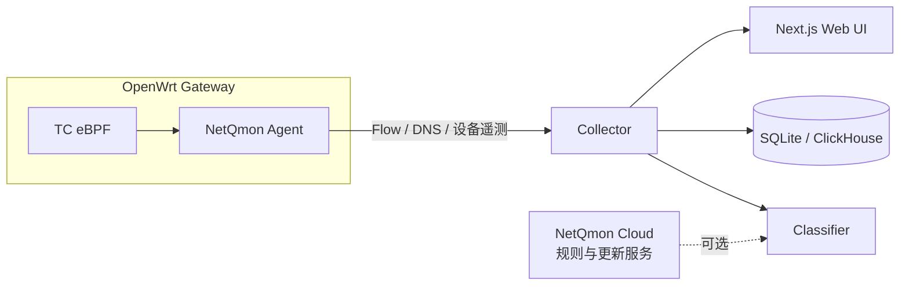

<p align="center">
  为 OpenWrt 提供清晰的网络可观测能力，从客户端、应用到 Flow 与目的地。
</p>

<p align="center">
  <a href="README.md">English</a> · <strong>简体中文</strong>
</p>

<p align="center">
  
  
  
  
</p>

<p align="center">
  
</p>

NetQmon 是一个面向 OpenWrt 的自托管网络可观测平台。它希望解决一件很直接的事情：让你知道网络里是谁在使用流量、访问了什么服务、流量去了哪里，以及这些活动在一段时间内发生了什么变化。

轻量级 Agent 运行在网关上，通过 TC eBPF 采集 Flow 遥测；Controller 负责存储、分类、实时展示、历史查询和 Web 界面。路由器专注于采集，复杂分析留给更适合做这件事的 Controller。

> NetQmon 当前专注于 **Observability**，不试图替代防火墙、QoS 或网络策略系统。

## 核心能力

| | |
| --- | --- |
| **客户端** | 查看实时上传/下载、历史流量，并关联 IP、MAC、hostname 与设备识别信息。 |
| **应用识别** | 综合组织、应用、分类、域名、协议、IP/ASN 元数据以及有限 DPI 信号进行流量分类。 |
| **Flow** | 查询 IPv4/IPv6 Flow，查看源/目的地址、协议、端口、流量与分类上下文。 |
| **目的地** | 从域名、国家/地区、ASN/ISP 和地理视图理解流量去向。 |
| **实时与历史** | 在同一个界面观察当前网络活动，并查询不同时间范围的历史数据。 |
| **OpenWrt 原生体验** | TC eBPF 数据面、`procd` 服务、UCI 配置、诊断命令，以及可选的 LuCI 管理界面。 |
| **自托管 Controller** | 通过 Docker 部署；默认使用 SQLite，也可以选择 ClickHouse 承载更大规模的数据。 |

## 工作方式



Agent 只承担流量采集和必要的轻量处理。分类、聚合、历史查询和可视化等工作由 Controller 完成，避免把复杂分析逻辑堆到路由器上。

## 快速开始

### Controller

```bash
git clone https://github.com/jarvis2f/netqmon.git
cd netqmon
docker compose up -d
```

Controller 健康检查通过后，访问 `http://localhost:3000`。

默认使用 SQLite 作为存储后端。在需要更高写入吞吐或更长数据保留期时，可以启用 ClickHouse。详细环境变量、端口与存储配置见 [Controller 配置与端口说明](controller-configuration.zh-CN.md)。

### OpenWrt Agent

NetQmon 目前优先支持运行在 **x86_64** 和 **aarch64** 架构上的 **OpenWrt 24.10+**。推荐 Linux **6.6+** 内核；在满足对应 eBPF/TC 能力时，**5.15+** 内核也可能可用。平台支持详情见 [平台支持矩阵](platform-support-matrix.md)。

先安装所需的内核模块：

```sh
opkg update
opkg install kmod-sched-core kmod-sched-bpf
```

随后从 Release 安装对应架构的 NetQmon Agent；如需要，也可以同时安装 LuCI 应用。配置 Controller 地址后，可使用下面的命令检查运行环境：

```sh
netqmon-agent doctor
```

完整命令行选项、诊断工具、UCI 配置与环境变量说明见 [Agent 命令与配置参考](agent-cli-reference.zh-CN.md)。

## Community 与 Pro

Community 和 Pro 使用同一套 NetQmon 监控能力与界面，两者的区别主要在于流量识别规则数据。

| 版本 | 规则数据 |
| --- | --- |
| **Community** | 面向常见应用和服务的社区规则数据集。 |
| **Pro** | 通过 NetQmon Cloud 提供规模更大、持续维护的规则数据集，以覆盖更多应用和组织。 |

Pro 扩展的是识别覆盖率，并不是另一套采集引擎，也不会把基础监控功能拆成单独的付费功能。

更多信息见 [netqmon.com](https://netqmon.com)。

## 隐私

NetQmon 的目标是网络可观测，而不是内容审查。协议识别在必要时可能读取连接开始阶段少量且受限的数据样本，但不会解密 TLS。

标准部署方式下，Controller 与流量数据库运行在你自己管理的设备或服务器上。

具体实现与采样限制见 [Privacy](docs/PRIVACY.md)。

## 项目结构

```text
bpf/                         TC eBPF 数据面
crates/agent/                OpenWrt userspace Agent
crates/collector/            数据接收、DPI、实时与查询管线
crates/classifier-client/    分类客户端
crates/classifier-manager/   规则生命周期与更新
crates/storage/              SQLite / ClickHouse 存储
apps/controller-ui/          Next.js Controller UI
packaging/openwrt/           OpenWrt 软件包与 LuCI 应用
deploy/docker/               Controller 容器构建
docs/                        架构、部署与协议文档
```

## 开发

后端：

```bash
cargo test --workspace
```

Controller UI：

```bash
pnpm install
pnpm lint
pnpm typecheck
pnpm build
pnpm e2e
```

## License

NetQmon 使用 [Apache License 2.0](LICENSE)。

---

<p align="center">
  <a href="https://netqmon.com">网站</a>
  ·
  <a href="https://github.com/jarvis2f/netqmon/releases">Releases</a>
</p>
